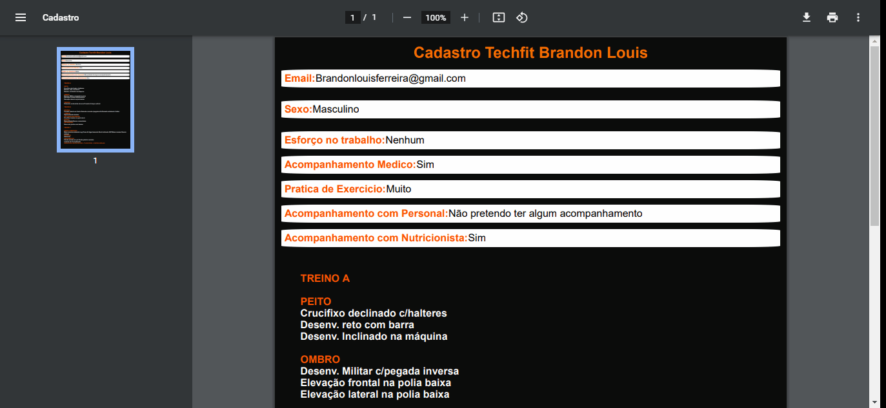

# Projeto 1 Gerador de Pdf 

<h2 style="color: rgb(247, 111, 0);"align="center">Esse trabalho foi um projeto do bootcamp infnet de fullstack developer</h2>


 

<p align="center">
<a href="#Sobre">Sobre</a> -
<a href="#tecnologias">Tecnologias</a> -
<a href="#pre-requisitos">Pré Requisitos</a> -
<a href="#autor">Autor</a>
<a href="#features">Features</a> 

</p>

# Sobre
<p>Esse projeto teve inicio com o objetivo claro a ser atingido com foco no aprendizado e dedicação.</p>
<p>Eu dividi esse projeto em três partes necessárias para meu aprendizado.</p>
<p>Com um mês de bootcamp pude ver minha evolução semanal nas três partes:</p>
<p>1 - dividir o momento de aprendizado com o momento de código.</p>
<p>2 - Aproveitar para apender mais sobre outras tecnologias e tentar implementa-lás no meu projeto, porém sem perder o objetivo.</p>
<p>3 - Não me pressionar e nem deixar outras coisas atrapalharem meu processo de aprendizado.</p>
<p>Agradecimento total a equipe do Bootcamp que tem me proporcionado um aprendizado imersivo e muito bem dividido</p>

# Features

-[x]Pagina Home 
<br>
<h1 align="center">

</h1>
<br>
-[x]Pagina de Planos
<br>
<h1 align="center">

</h1>
<br>
-[x]Preenchimento de formulario
<br>
<h1 align="center">

</h1>
<br>
-[x]Geração de PDF
<br>
<h1 align="center">

</h1>

## pre-requisitos
Antes de começar, você precisa ter instalado em sua máquina as seguintes ferramentas:
[Git](https://git-scm.com), [Node.js](https://nodejs.org/en/).
Além disto é bom ter um editor para trabalhar com o código como [VsCode](https://code.visualstudio.com/)

## Rodando o Front End

```bash
#Clone este repositório
$ git clone <https://gitlab.com/Loouisbrandon/belezinha.git>

# Acesse a pasta do projeto no terminal/cmd
$ cd belezinha

#Instale as dependências 
$ npm

# Execute a aplicação em modo de desenvolvimento 
$ npm run dev

# O servidor iniciará na porta:5000 - acesse <http://localhost:5000>
```

## Tecnologias
As seguintes ferramentas foram usadas na construção desse projeto:

- [JavaScript](https://www.javascript.com/)
- [Node.js](https://nodejs.org/en/)
- [VisualStudio](https://code.visualstudio.com/)
---------------------
## Autor
Feito com Foco e muitas horas de aprendizado by BRANDON LOUIS 👋 <a href="#https://www.linkedin.com/in/brandon-louis-4ba989105">see my linkedIn</a>

